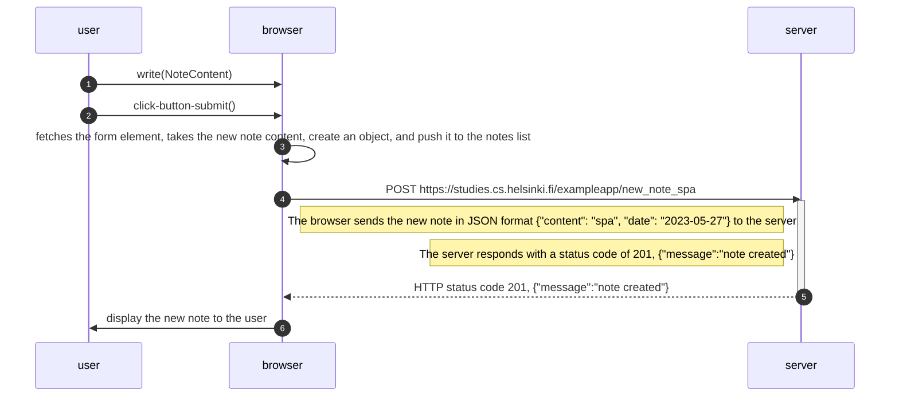

```mermaid
sequenceDiagram
  autonumber
  

  user->>browser: write(NoteContent)
  user->>browser: click-button-submit()
  
  
  browser->>browser: fetches the form element, takes the new note content, create an object, and push it to the notes list
  
  
  browser->>server: POST https://studies.cs.helsinki.fi/exampleapp/new_note_spa
  activate server
  Note right of browser: The browser sends the new note in JSON format {"content": "spa", "date": "2023-05-27"} to the server
  Note left of server: The server responds with a status code of 201, {"message":"note created"}
  server-->>browser: HTTP status code 201, {"message":"note created"}
  deactivate server
  
  browser->>user: display the new note to the user
  
  
 
```
