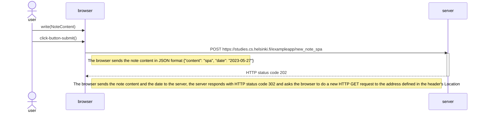

```mermaid
sequenceDiagram
  actor user
  participant browser
  participant server

  user->>browser: write(NoteContent)
  user->>browser: click-button-submit()
  
  browser->>server: POST https://studies.cs.helsinki.fi/exampleapp/new_note_spa
  activate server
  Note right of browser: The browser sends the note content in JSON format {"content": "spa", "date": "2023-05-27"}
  server-->>browser: HTTP status code 202
  deactivate server
  
  Note right of browser: The browser sends the note content and the date to the server, the server responds with HTTP status code 302 and asks the browser to do a new HTTP GET request to the address defined in the header's Location
  
 
```
